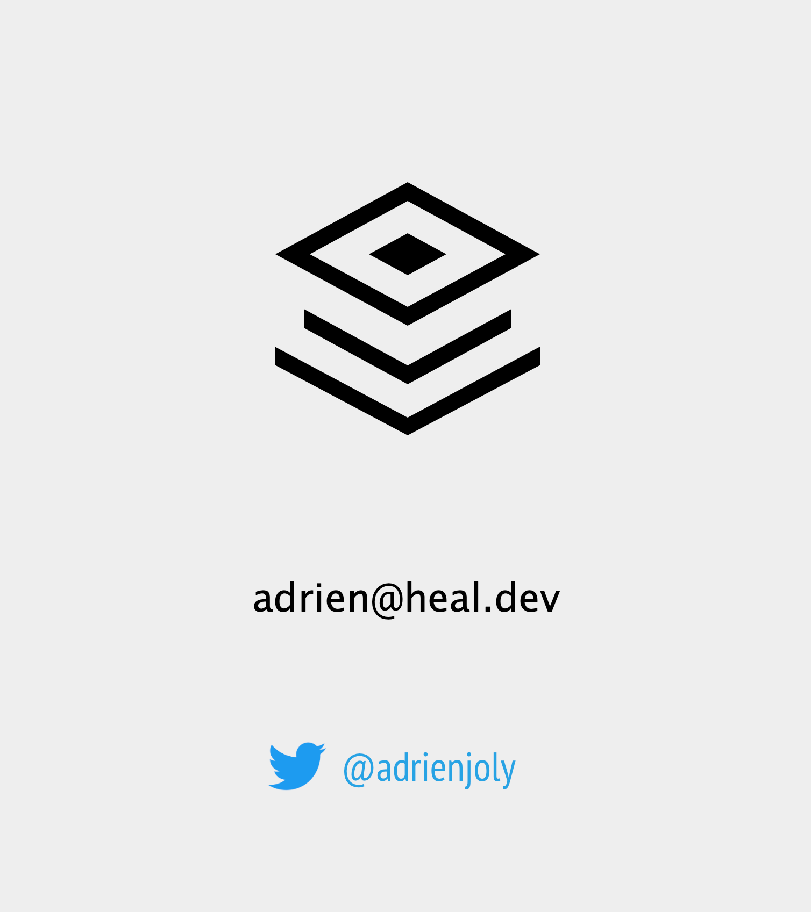

<!-- proposal: https://gospeak.io/u/talks/code-legacy-les-cles-pour-s-en-sortir -->

# **Code legacy 🧟**

Les clés pour s'en sortir !

<!--
PLAN:
- Le code legacy: def, symptomes, problèmes (2mn)
- Pistes et écueils typiques ⇒ clés (3mn)
- Étude de cas (4mn)
- Take-aways / à retenir (1mn)
-->

---

> "Legacy Code is **valuable** code you’re **afraid** to change"

Nicolas Carlo & Alex Bolboaca

<!-- notion de peur mais aussi de valeur pour l'entreprise -->

---

## **Symptomes** de code legacy

* 👼 Devs *irremplaçables*

* 😅 Délais et/ou craintes

* 🫣 Recrutement difficile

* 🥵 Bugs et regressions

---

## Problèmes pour les **dévs**

1. 😓 Rechignement

2. 😤 Tensions

3. 🙈 Résignation

---

## Problèmes pour l’**entreprise** 🏭

- 📉 Perte de compétitivité

- 👋 Churn

- ⚰️ “bus factor” 

---

🛠️ REMEDIATION ?

---

## ❌ Pas le temps / pas le budget

* **Risques et/ou coûts** à présenter

---

## ❌ Refonte en sous-marin

* **Confiance** à recréer entre équipes

<!--
Raisons de ne pas le faire:
- perte de confiance: PM et/ou direction
- deux codebases à maintenir 🥵
- risque de refonte avortée
    - ex: codebase laissée dans un état encore pire
-->

---

## ❌ Refonte sans fin

* **Planification** et accompagnement à prévoir

---

📌 ÉTUDE DE CAS

---

## **Situation**

* Entreprise veut s'ouvrir aux USA
* Complexité croissante du code
* Dévs ont peur de tout casser

---

## 🔬 **Mesure** des coûts et risques

Sur les 6 derniers mois:

* Taille + complexité + qualité du code de "checkout"
* Ratio bug/feature
* Ratio retard/estimation
* Nombre de régressions fonctionnelles

---

## 🧭 **Proposition** d'un plan

**Périmètre** d'intervention initial: code de "checkout"

* Prévenir **anomalies**: usage de *value objects* (DDD)
* Explicitation **devises**: migration de base de données
* **Suivi** des évènements traités par le code *legacy*
* ... et ce, sans *code freeze*
* **Comparer** le coût: refonte VS status quo

<!-- retirés par soucis de concision:
3) **Livraisons**: délégation à une API SaaS externe
4) **Cohérence** données: retrait d'un cache interne
-->

---

## 🤝 **Coordination** avec collègues

* Informer l'**équipe produit** des coûts et risques actuels
* **Présenter** le plan de refonte
* Négocier sur **planification** des chantiers
* Obtenir l'**accord** de la direction

---

## 📈 **Suivi** et réassurance

* Éviter **tunnel**: baby steps + déploiements réguliers
* Vérifier que tout changement peut être **annulé** en 1mn
* **Cranter** la qualité à chaque amélioration
* **Partager** l'avancement avec les personnes intéressées
* Coordination: **négocier** ajustements si nécessaire
* Être transparent sur risques. **Célébrer** les victoires !

---

## 🍱 **À retenir**

* Legacy = **coûts** + **risques** → entreprise

* Réécriture from scratch = **danger**

* Mesurer → Proposer → Accorder → Rassurer

* Dé-risquer: PoC, baby steps, déploiment continu

---

## 🍱 **À retenir**

- Legacy = **coûts** + **risques** → entreprise

- Réécriture from scratch = **danger**

- Mesurer → Proposer → Accorder → Rassurer

- Dé-risquer: PoC, baby steps, déploiment continu

<!--
Take-aways: (1mn)
- Devs ET entreprise ont **intérêt à maitriser** la complexité accidentelle de leur code
- **Prioriser les problèmes** en fonction des coûts & risques induits ET de la direction stratégique de l’entreprise
- **Convaincre** sur la base d’un **plan** avec objectifs mesurables
- Avancer **progressivement**, en rassurant les personnes impactées
-->
